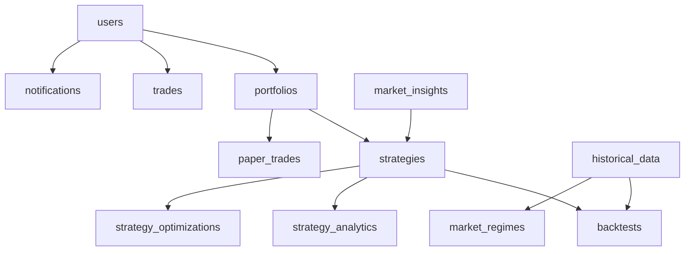

# Collections Documentation

This document provides a comprehensive overview of all database collections used in the Strategy Forge Insight application, including both MongoDB and Firestore collections.

## MongoDB Collections

### 1. strategies
**Status**: ✅ Created  
**Description**: Stores trading strategy metadata and performance metrics

| Field | Type | Description |
|-------|------|-------------|
| _id | ObjectId | Unique identifier |
| title | string | Strategy name |
| description | string | Strategy description |
| performance | number | Performance percentage |
| sharpe | number | Sharpe ratio |
| drawdown | number | Maximum drawdown percentage |
| winrate | number | Win rate percentage |
| tags | array[string] | Strategy tags |
| downloads | number | Download count |
| rating | number | User rating (1-5) |
| category | string | Strategy category (optional) |
| difficulty | string | Difficulty level (optional) |
| author | string | Strategy author (optional) |
| lastUpdated | string | Last update timestamp (optional) |
| status | string | Strategy status (optional) |

### 2. drag_drop_strategies
**Status**: ✅ Created  
**Description**: Stores drag-and-drop strategy builder configurations (JSON-first strategy definition for backtesting)

| Field | Type | Description |
|-------|------|-------------|
| _id | ObjectId | Unique identifier |
| name | string | Strategy name |
| description | string | Short description |
| ownerId | string | Creator user ID |
| visibility | string | "private" or "public" |
| timeframe | string | Timeframe (e.g., 1h, 1d) |
| indicators | array[Indicator] | Indicators used |
| conditions | array[Condition] | Entry/exit rules |
| riskManagement | RiskManagement | Risk settings |
| pineScriptCode | string (optional) | Optional TradingView export |
| createdAt | datetime | Creation timestamp |
| updatedAt | datetime | Last update timestamp |

**Indicator Structure:**
| Field | Type | Description |
|-------|------|-------------|
| id | string | Unique reference id |
| type | string | Indicator type (RSI, SMA, etc.) |
| params | object | Key-value parameters |

**Condition Structure:**
| Field | Type | Description |
|-------|------|-------------|
| id | string | Unique condition id |
| type | string | "entry" or "exit" |
| expression | object | `{ left, operator, right }` |
| action | object | Entry: `{ side, entryName }`, Exit: `{ exitFrom }` |

`expression.left` can be an indicator id or a literal like `open`, `high`, `low`, `close`, `volume`.  
`expression.right` must be either `{ value: number }` or `{ indicator: string }`.

**RiskManagement Structure:**
| Field | Type | Description |
|-------|------|-------------|
| stopLoss | object | `{ type: 'percentage'|'fixed', value: number }` |
| takeProfit | object | `{ type: 'percentage'|'fixed', value: number }` |
| capital | number | Starting balance |
| positionSize | string | `fixed` or `percent_of_equity` |
| positionValue | number | Amount or percent |

### 3. historical_data
**Status**: ✅ Created  
**Description**: Caches historical OHLCV market data

| Field | Type | Description |
|-------|------|-------------|
| _id | ObjectId | Unique identifier |
| symbol | string | Trading symbol (e.g., NIFTY, INFY) |
| timeframe | string | Time frame (1d, 1h, 30m, 15m) |
| data | array[object] | OHLCV data points |
| source | string | Data source (yahoo, local) |
| last_updated | datetime | Last update timestamp |

**Data Point Structure:**
| Field | Type | Description |
|-------|------|-------------|
| date | string | Date in ISO format |
| open | number | Opening price |
| high | number | High price |
| low | number | Low price |
| close | number | Closing price |
| volume | number | Trading volume |

### 4. strategy_definitions
**Status**: ✅ Created  
**Description**: JSON-first strategy definitions used for backtesting (single source of truth)

| Field | Type | Description |
|-------|------|-------------|
| _id | ObjectId | Unique identifier |
| name | string | Strategy name |
| description | string | Short description |
| ownerId | string | Creator user ID |
| visibility | string | "private" or "public" |
| timeframe | string | Timeframe (e.g., 1h, 1d) |
| indicators | array[Indicator] | Indicators used |
| conditions | array[Condition] | Entry/exit rules |
| riskManagement | RiskManagement | Risk settings |
| pineScriptCode | string (optional) | Optional TradingView export |
| createdAt | datetime | Creation timestamp |
| updatedAt | datetime | Last update timestamp |

**Indicator Structure:**
| Field | Type | Description |
|-------|------|-------------|
| id | string | Unique reference id |
| type | string | Indicator type (RSI, SMA, etc.) |
| params | object | Key-value parameters |

**Condition Structure:**
| Field | Type | Description |
|-------|------|-------------|
| id | string | Unique condition id |
| type | string | "entry" or "exit" |
| expression | object | `{ left, operator, right }` |
| action | object | Entry: `{ side, entryName }`, Exit: `{ exitFrom }` |

`expression.left` can be an indicator id or a literal like `open`, `high`, `low`, `close`, `volume`.  
`expression.right` must be either `{ value: number }` or `{ indicator: string }`.

**RiskManagement Structure:**
| Field | Type | Description |
|-------|------|-------------|
| stopLoss | object | `{ type: 'percentage'|'fixed', value: number }` |
| takeProfit | object | `{ type: 'percentage'|'fixed', value: number }` |
| capital | number | Starting balance |
| positionSize | string | `fixed` or `percent_of_equity` |
| positionValue | number | Amount or percent |

### 5. backtests
**Status**: ✅ Created  
**Description**: Stores backtest execution results

| Field | Type | Description |
|-------|------|-------------|
| _id | ObjectId | Unique identifier |
| symbol | string | Trading symbol |
| timeframe | string | Time frame |
| rows | number | Number of data points |
| metrics | object | Performance metrics |
| equity_curve | array[object] | Equity curve data |
| conditions | object | Strategy conditions |
| requested_at | datetime | Backtest request timestamp |
| strategy | object | Strategy configuration |
| simulation_context | object | Simulation parameters |
| start_date | string | Backtest start date |
| end_date | string | Backtest end date |

## Firestore Collections

### 1. users
**Status**: 🔄 Planned  
**Description**: User profiles and authentication data

| Field | Type | Description |
|-------|------|-------------|
| uid | string | Firebase user ID |
| email | string | User email |
| displayName | string | User display name |
| photoURL | string | Profile photo URL |
| createdAt | timestamp | Account creation time |
| lastLoginAt | timestamp | Last login time |
| preferences | object | User preferences |
| subscription | object | Subscription details |
| isActive | boolean | Account status |

### 2. portfolios
**Status**: 🔄 Planned  
**Description**: User portfolio configurations

| Field | Type | Description |
|-------|------|-------------|
| id | string | Portfolio ID |
| userId | string | Owner user ID |
| name | string | Portfolio name |
| description | string | Portfolio description |
| strategies | array[string] | Associated strategy IDs |
| riskProfile | string | Risk tolerance level |
| createdAt | timestamp | Creation time |
| updatedAt | timestamp | Last update time |
| isActive | boolean | Portfolio status |

### 3. trades
**Status**: 🔄 Planned  
**Description**: Trading history and transactions

| Field | Type | Description |
|-------|------|-------------|
| id | string | Trade ID |
| userId | string | User ID |
| portfolioId | string | Portfolio ID |
| strategyId | string | Strategy ID |
| symbol | string | Trading symbol |
| type | string | Trade type (buy/sell) |
| quantity | number | Trade quantity |
| price | number | Execution price |
| timestamp | timestamp | Trade timestamp |
| status | string | Trade status |
| pnl | number | Profit/Loss |

### 4. notifications
**Status**: 🔄 Planned  
**Description**: User notifications and alerts

| Field | Type | Description |
|-------|------|-------------|
| id | string | Notification ID |
| userId | string | Target user ID |
| type | string | Notification type |
| title | string | Notification title |
| message | string | Notification content |
| isRead | boolean | Read status |
| createdAt | timestamp | Creation time |
| priority | string | Priority level |
| actionUrl | string | Action URL (optional) |

### 5. market_insights
**Status**: 🔄 Planned  
**Description**: AI-generated market insights and analysis

| Field | Type | Description |
|-------|------|-------------|
| id | string | Insight ID |
| symbol | string | Market symbol |
| timeframe | string | Analysis timeframe |
| insightType | string | Type of insight |
| content | string | Insight content |
| confidence | number | Confidence score (0-1) |
| createdAt | timestamp | Creation time |
| expiresAt | timestamp | Expiration time |
| tags | array[string] | Insight tags |

### 6. strategy_analytics
**Status**: 🔄 Planned  
**Description**: Strategy performance analytics and metrics

| Field | Type | Description |
|-------|------|-------------|
| id | string | Analytics ID |
| strategyId | string | Strategy ID |
| userId | string | User ID |
| period | string | Analysis period |
| metrics | object | Performance metrics |
| generatedAt | timestamp | Generation time |
| dataPoints | number | Number of data points |
| accuracy | number | Strategy accuracy |

## Planned MongoDB Collections

### 1. user_sessions
**Status**: 🔄 Planned  
**Description**: User session management

| Field | Type | Description |
|-------|------|-------------|
| _id | ObjectId | Unique identifier |
| user_id | string | User ID |
| session_token | string | Session token |
| created_at | datetime | Session start time |
| expires_at | datetime | Session expiration |
| ip_address | string | Client IP address |
| user_agent | string | Client user agent |
| is_active | boolean | Session status |

### 2. strategy_optimizations
**Status**: 🔄 Planned  
**Description**: Strategy parameter optimization results

| Field | Type | Description |
|-------|------|-------------|
| _id | ObjectId | Unique identifier |
| strategy_id | string | Strategy ID |
| user_id | string | User ID |
| optimization_type | string | Optimization method |
| parameters | object | Optimized parameters |
| results | object | Optimization results |
| created_at | datetime | Creation time |
| performance_metrics | object | Performance metrics |

### 3. market_regimes
**Status**: 🔄 Planned  
**Description**: Market regime analysis data

| Field | Type | Description |
|-------|------|-------------|
| _id | ObjectId | Unique identifier |
| symbol | string | Trading symbol |
| timeframe | string | Time frame |
| regime_type | string | Market regime type |
| start_date | datetime | Regime start |
| end_date | datetime | Regime end |
| confidence | number | Regime confidence |
| characteristics | object | Regime characteristics |
| created_at | datetime | Analysis time |

### 4. paper_trades
**Status**: 🔄 Planned  
**Description**: Paper trading simulation data

| Field | Type | Description |
|-------|------|-------------|
| _id | ObjectId | Unique identifier |
| user_id | string | User ID |
| strategy_id | string | Strategy ID |
| symbol | string | Trading symbol |
| trade_type | string | Trade type |
| quantity | number | Trade quantity |
| entry_price | number | Entry price |
| exit_price | number | Exit price (if closed) |
| pnl | number | Profit/Loss |
| created_at | datetime | Trade creation |
| closed_at | datetime | Trade closure (if closed) |
| status | string | Trade status |

## Database Configuration

### MongoDB
- **Database Name**: `strategy_forge`
- **Connection**: MongoDB Atlas
- **Driver**: Motor (AsyncIO)

### Firestore
- **Project ID**: `microproject2-7ac7e`
- **Authentication**: Firebase Auth
- **Storage**: Firebase Storage

## Collection Relationships

## Indexes and Performance

### MongoDB Indexes
- `strategies`: `{title: 1}`, `{category: 1}`, `{rating: -1}`
- `historical_data`: `{symbol: 1, timeframe: 1}`, `{last_updated: -1}`
- `backtests`: `{symbol: 1, timeframe: 1}`, `{requested_at: -1}`
- `drag_drop_strategies`: `{user_id: 1}`, `{created_at: -1}`

### Firestore Indexes
- `users`: `{email: 1}`, `{createdAt: -1}`
- `trades`: `{userId: 1, timestamp: -1}`, `{portfolioId: 1, timestamp: -1}`
- `notifications`: `{userId: 1, isRead: 1}`, `{createdAt: -1}`

## Data Retention Policies

- **Historical Data**: 5 years
- **Backtest Results**: 2 years
- **User Sessions**: 30 days
- **Notifications**: 90 days
- **Strategy Analytics**: 1 year
- **Paper Trades**: 6 months

## Security Considerations

- All collections implement proper access controls
- User data is encrypted at rest
- API endpoints require authentication
- Sensitive data is masked in logs
- Regular security audits and updates

---

*Last Updated: [Current Date]*
*Version: 1.0*